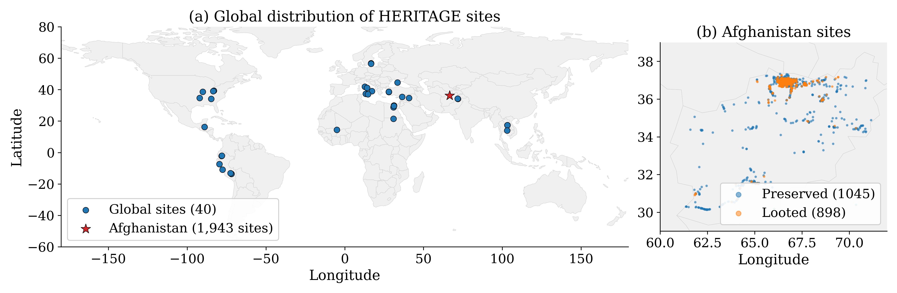
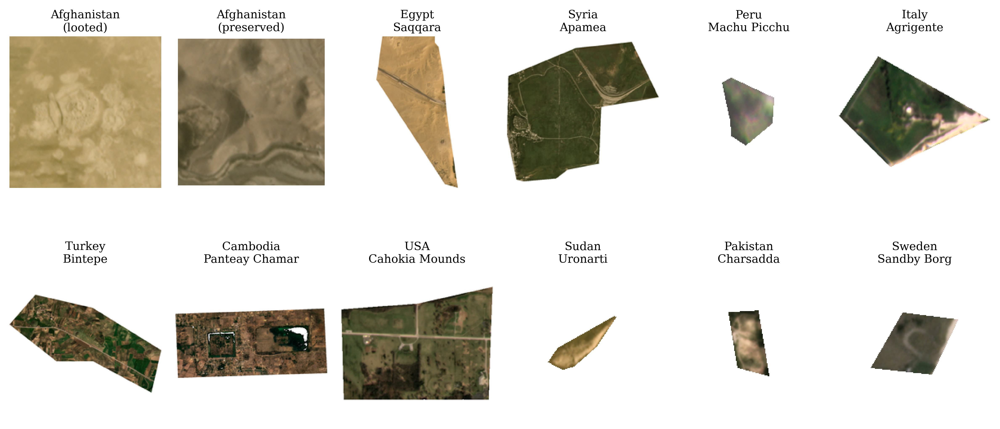
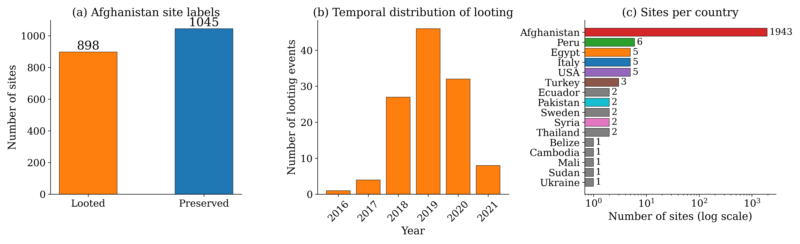
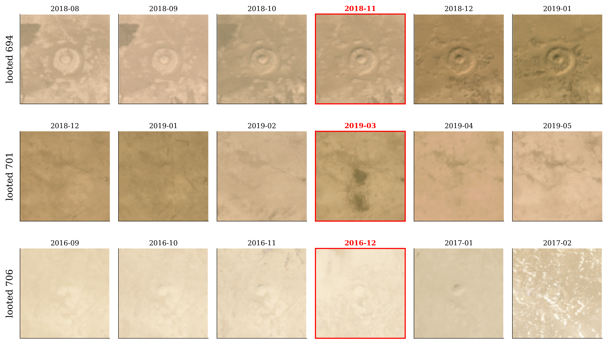
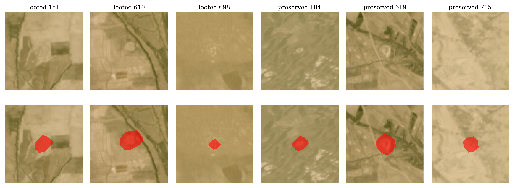
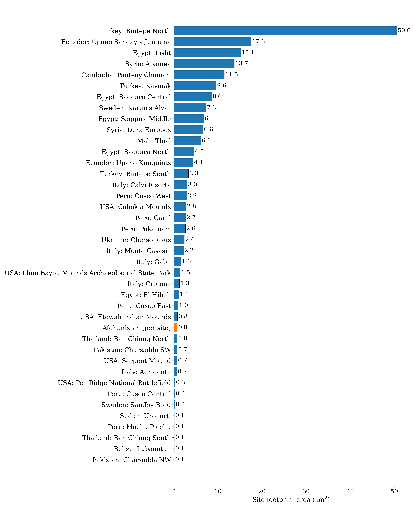
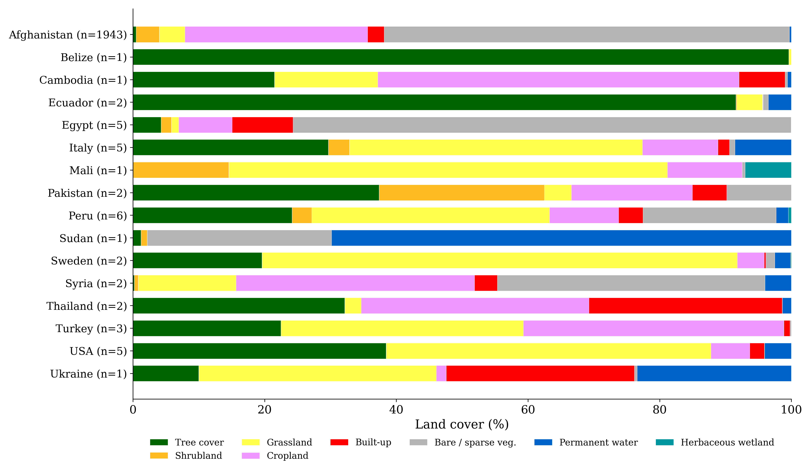
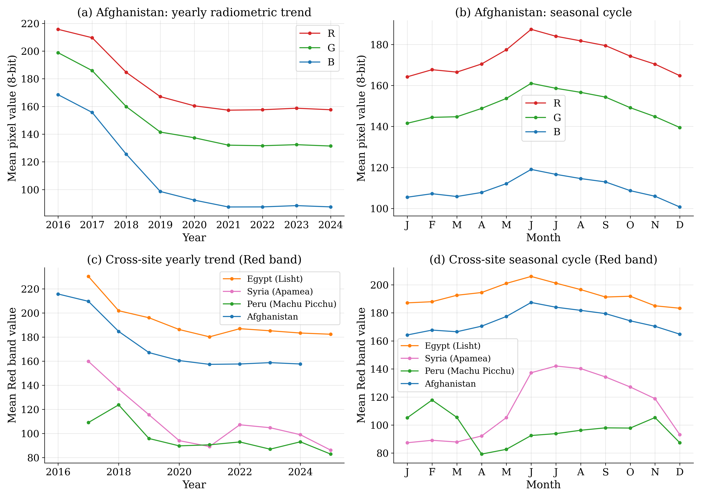

# HERITAGE Dataset

A satellite image dataset for monitoring archaeological sites, derived from Planet Labs monthly basemap mosaics at 4.77 m/pixel resolution. HERITAGE covers 1,982 sites across 16 countries with monthly observations from January 2016 through May 2025.

The Afghanistan subset contains 1,943 sites with binary looting labels (898 looted, 1,045 preserved), per-site bounding masks, and month-of-disturbance annotations for 118 sites with confirmed change events. The global subset adds 39 sites across 15 additional countries on five continents. Among public archaeological monitoring datasets, HERITAGE is larger than prior releases on number of sites (1,982), countries (16), images (212,776), and months of coverage (113). Site coordinates are withheld to protect the locations from exploitation; the processing pipeline and ground-truth labels are released with the imagery.

## Geographic coverage



*Geographic distribution of HERITAGE sites. (a) World map of the 40 global monitoring locations across 16 countries: 39 individual archaeological sites in 15 countries (blue circles) and the Afghanistan region (red star, containing 1,943 sub-sites). (b) Afghanistan detail showing the spatial distribution of 898 looted (orange) and 1,045 preserved (blue) archaeological sites.*

The 39 global sites span 15 countries: Belize (1), Cambodia (1), Ecuador (2), Egypt (5), Italy (5), Mali (1), Pakistan (2), Peru (6), Sudan (1), Sweden (2), Syria (2), Thailand (2), Turkey (3), Ukraine (1), and the USA (5). Each global site has 100-101 monthly observations. Geographic metadata is stripped from the released PNG files; coordinates are not distributed with the imagery.

## Sample imagery



*Sample RGB composites from 12 HERITAGE sites spanning 10 countries. Images are displayed at 186 x 186 pixels (rescaled for global sites). Each image shows a single monthly observation from the middle of the site's time series.*

## Dataset summary

The dataset is partitioned into an Afghanistan subset (1,943 fully annotated sites) and a global subset (39 sites across 15 countries, imagery only). Subset-specific attributes are shown side by side; shared attributes are listed below the divider. Combined totals are 1,982 sites, 212,776 images, and 113 distinct months of monthly coverage from January 2016 through May 2025.

| Attribute | Afghanistan sites | Global sites |
|---|---|---|
| Number of sites | 1,943 (898 looted, 1,045 preserved) | 39 across 15 countries |
| Number of images | 208,839 | 3,937 |
| Temporal range | January 2016 to December 2024 | January 2017 to May 2025 |
| Months per site | up to 108 (median 107) | 100-101 |
| Image dimensions | 186 x 186 pixels | per-site majority dimension |
| Site footprint | ~1 km x 1 km (fixed) | 0.1 - 50.6 km^2 |
| Binary site mask | Provided (1,943 PNGs) | Not provided |
| Looting label | Provided (898 looted, 1,045 preserved) | Not provided |
| Change-month label | Provided (118/898 confirmed) | Not provided |

*Shared across both subsets:* 3 spectral bands (R, G, B) plus a 1-channel data validity mask; 4.77 m/pixel spatial resolution (Web Mercator zoom level 15); monthly cadence; 4-band PNG (RGBA, 8-bit unsigned per channel) image format; single-band PNG (binary, 0/255) mask format; Planet Labs monthly basemap mosaics (PlanetScope, Dove constellation) as the data source.



*Dataset statistics. (a) Distribution of looted vs. preserved labels in the Afghanistan subset. (b) Temporal distribution of confirmed looting events by year (118 sites with known change month, peak in 2019). (c) Number of monitoring sites per country (log scale); Afghanistan accounts for 1,943 of the 1,982 sites.*

## Comparison with prior datasets

The table below compares HERITAGE to earlier archaeological remote-sensing datasets. Among the publicly released datasets in this list, only DAFA-LS (Vincent et al., 2024) predates HERITAGE; HERITAGE adds multi-country coverage, more months of observation, and per-site change-month labels. Image counts are reported only where the source paper specifies them; "---" indicates not reported. "Change month" is a per-site month-of-disturbance label for looted sites. "Site mask" is a binary raster delineating the archaeological area within each image chip.

| Dataset | Sites | Countries | Months | Images | Change month | Site mask | Public |
|---|---:|---:|---:|---:|:---:|:---:|:---:|
| Casana (2015) | >1,200 | 1 | 1 | --- | --- | --- | No |
| Parcak et al. (2016) | 1,100 | 1 | 2-4 | --- | --- | --- | No |
| Tapete et al. (2016) | 1 | 1 | --- | --- | --- | --- | No |
| Lauricella et al. (2017) | 1 | 1 | 1 | --- | --- | --- | No |
| Tadesse et al. (2026a) | 1,943 | 1 | 96 | --- | --- | --- | No |
| Tadesse et al. (2026b) | 1,943 | 5 | 96 | --- | Yes | --- | No |
| Vincent et al. (2024) [DAFA-LS] | 675 | 1 | 96 | 55,480 | --- | Yes | Yes |
| **HERITAGE** | **1,982** | **16** | **113** | **212,776** | **Yes** | **Yes** | **Yes** |

## Directory structure

The Zenodo release ships as two archives so users who need only one subset can download the smaller file. Each archive carries a top-level `manifest.csv` describing every file inside it; the Zenodo record also carries a combined `manifest.csv` that is the concatenation of the two (Afghanistan rows first, then Global). See [Download](#download) for the validation recipe.

**`HERITAGE-Afghanistan.zip`** (~10.8 GB, 210,783 files)

```
looted/
  looted_0/
    2016_01.png
    2016_02.png
    ...
    mask.png
  looted_1/
    ...
preserved/
  preserved_0/
    ...
  ...
ground_truth.csv
manifest.csv
```

**`HERITAGE-Global.zip`** (~874 MB, 3,937 files)

```
global/
  Belize_Lubaantun/
    2017_01.png
    ...
  Cambodia_Panteay_Chamar_/
    ...
  [37 additional global site directories]
manifest.csv
```

## Layout notes

- `ground_truth.csv` lists the three label fields for each of the 1,943 Afghanistan sites: `site_name`, `looted` (binary), and `looted_month` (integer month index when looting was detected; `-1` if confirmed but month unknown; `0` for preserved sites). It ships at the top level of `HERITAGE-Afghanistan.zip`.
- Afghanistan site directories follow the naming pattern `{looted,preserved}_N`, where `N` is a zero-indexed site identifier. They live under `looted/` or `preserved/` at the top level of `HERITAGE-Afghanistan.zip`. Each contains monthly RGBA PNG chips and a `mask.png` raster delineating the archaeological area.
- Global site directories follow the naming pattern `Country_SiteName` (39 directories across 15 countries) and live under `global/` at the top level of `HERITAGE-Global.zip`. They contain monthly RGBA PNG chips; no per-site masks are provided.
- File names follow `YYYY_MM.png`, where `YYYY` is the four-digit year and `MM` is the two-digit month.
- Images are stored as four-channel PNGs (height x width x 4): the first three channels are R, G, B spectral values; the fourth (alpha) channel is a binary data-validity mask (255 for valid pixels, 0 for zero-padding outside the site extent).
- Geographic metadata (coordinate reference system, affine transform) is removed during conversion to prevent direct geolocation of sites from the image files.
- Users who want a single tree for training can extract both archives side by side and merge them; the combined layout is `looted/`, `preserved/`, `global/`, `ground_truth.csv` at one root.

## Ground-truth labels

The schema below describes the three fields in `ground_truth.csv` (top level of `HERITAGE-Afghanistan.zip`), provided for each of the 1,943 Afghanistan sites. Labels were assigned by archaeological experts at ICONEM through visual interpretation of high-resolution satellite imagery, corroborated by field survey data where available. The annotation protocol first classified each site as looted or preserved based on the presence of surface disturbance in the imagery, then identified the specific month of disturbance for looted sites by inspecting sequential monthly images for the first appearance of pitting or trenching.

| Field | Type | Description |
|---|---|---|
| `site_name` | string | Identifier in the format `{looted,preserved}_N`. |
| `looted` | binary | 1 = looted, 0 = preserved. |
| `looted_month` | integer | Month index when looting was detected; `-1` if confirmed but month unknown; `0` for preserved sites. |

## Looting sequence examples



*Temporal progression around looting events at three Afghanistan sites. Each row shows six consecutive monthly RGB composites. The change month (red label, red border) marks the first observation of visible surface disturbance. Preceding months show the undisturbed state; subsequent months show post-looting conditions.*

## Site bounding masks

Binary bounding masks are provided for the Afghanistan subset only. Each Afghanistan site directory contains a `mask.png` file where foreground pixels (value 255) indicate the archaeological area and background pixels (value 0) indicate areas outside the site boundary. Masks are 186 x 186 pixels and aligned to the image chip grid. They were produced by manually digitising the polygon of each site against high-resolution reference imagery, then rasterising. All 1,943 Afghanistan sites (898 looted, 1,045 preserved) include a mask. No masks are provided for global sites.



*Binary bounding mask examples for six randomly selected Afghanistan sites with full pixel coverage. Top row: RGB composites from the middle of each site's time series. Bottom row: the same images with the bounding mask overlaid in red, delineating the archaeological area within the 186 x 186 pixel chip. Left three columns show looted sites; right three columns show preserved sites. Masks vary in size and shape, reflecting the irregular boundaries of the underlying archaeological features.*

## Site spatial extents

Global site footprints range from 0.1 km^2 (Pakistan, Charsadda NW; Belize, Lubaantun) to 50.6 km^2 (Turkey, Bintepe North). Afghanistan sites each cover an approximately 1 km x 1 km footprint (186 x 186 pixels at 4.77 m/pixel).



*Spatial footprint of each HERITAGE site in km^2. Global sites (blue) range from 0.1 to 50.6 km^2. Afghanistan sites (orange) each cover an approximately 1 km x 1 km footprint.*

## Land cover context

Land cover composition around each site was extracted from the ESA WorldCover 2021 product (10 m resolution, 11 classes derived from Sentinel-1 and Sentinel-2). Afghanistan sites are dominated by bare or sparse vegetation (61.5%) and cropland (27.7%), consistent with the arid steppe and irrigated agriculture of the northern Afghan provinces where sites concentrate. Global sites span a wider range: Belize (Lubaantun) sits within dense tropical forest (99.6% tree cover); Sudan (Uronarti), a Nile island fortress, is surrounded by permanent water (69.8%); Italian sites occupy Mediterranean grassland and forest; and Thai sites show mixed cropland, forest, and built-up areas. This diversity is relevant for transfer-learning experiments, as models trained on Afghan sites must generalize across different spectral backgrounds.

Mean percentage of pixels per WorldCover class within each site's spatial extent, aggregated by country. The three residual WorldCover classes not shown (snow and ice, mangroves, moss and lichen) account for 0.0% of pixels at every HERITAGE site.

| Country | N | Tree | Shrub | Grass | Crop | Built | Bare | Water | Wetland |
|---|---:|---:|---:|---:|---:|---:|---:|---:|---:|
| Afghanistan | 1943 | 0.5 | 3.5 | 3.9 | 27.7 | 2.5 | 61.5 | 0.3 | 0.0 |
| Belize | 1 | 99.6 | 0.0 | 0.4 | 0.0 | 0.0 | 0.0 | 0.0 | 0.0 |
| Cambodia | 1 | 21.5 | 0.0 | 15.7 | 54.9 | 7.0 | 0.4 | 0.6 | 0.0 |
| Ecuador | 2 | 91.6 | 0.1 | 3.9 | 0.1 | 0.0 | 0.8 | 3.5 | 0.0 |
| Egypt | 5 | 4.3 | 1.6 | 1.1 | 8.1 | 9.3 | 75.6 | 0.0 | 0.1 |
| Italy | 5 | 29.7 | 3.2 | 44.5 | 11.5 | 1.7 | 0.8 | 8.6 | 0.0 |
| Mali | 1 | 0.0 | 14.6 | 66.6 | 11.3 | 0.0 | 0.4 | 0.0 | 7.0 |
| Pakistan | 2 | 37.4 | 25.1 | 4.1 | 18.4 | 5.2 | 9.8 | 0.0 | 0.0 |
| Peru | 6 | 24.2 | 3.0 | 36.1 | 10.5 | 3.7 | 20.2 | 1.9 | 0.4 |
| Sudan | 1 | 1.2 | 0.9 | 0.0 | 0.0 | 0.0 | 28.0 | 69.8 | 0.0 |
| Sweden | 2 | 19.6 | 0.0 | 72.2 | 4.1 | 0.2 | 1.4 | 2.4 | 0.1 |
| Syria | 2 | 0.2 | 0.6 | 14.9 | 36.2 | 3.5 | 40.6 | 4.0 | 0.0 |
| Thailand | 2 | 32.2 | 0.0 | 2.5 | 34.6 | 29.3 | 0.0 | 1.4 | 0.0 |
| Turkey | 3 | 22.5 | 0.1 | 36.7 | 39.6 | 0.9 | 0.2 | 0.0 | 0.0 |
| USA | 5 | 38.4 | 0.0 | 49.3 | 5.9 | 2.2 | 0.0 | 4.1 | 0.0 |
| Ukraine | 1 | 10.0 | 0.0 | 36.1 | 1.5 | 28.6 | 0.4 | 23.4 | 0.0 |



*Land cover composition by country, derived from ESA WorldCover 2021. Each bar shows the mean percentage of land cover classes across sites in that country. Site counts are shown in parentheses.*

## Spectral characteristics

Per-band pixel value statistics for the Afghanistan subset (non-padding pixels, 30 sampled sites). Values are 8-bit unsigned integers in the range 0-255.

| Band | Mean | Std |
|---|---:|---:|
| Red | 173.0 | 17.9 |
| Green | 151.4 | 15.1 |
| Blue | 115.1 | 14.6 |

Mean values for all three spectral bands decreased between 2016 and 2019, then stabilized from 2020 onward. This radiometric shift reflects evolving sensor calibration and compositing methods in the Planet basemap product over the observation period. Users training models across years should account for these temporal shifts through normalization or domain adaptation. Across 30 sampled Afghanistan sites the mean no-data pixel fraction (pixels where all channels equal zero) is 4.7%, with a range of 0.0-35.1%. Global sites have higher no-data fractions (up to 66% for irregularly shaped sites such as Ecuador, Upano Sangay) because rectangular image chips contain padding around non-rectangular site footprints.



*Radiometric trends across the HERITAGE dataset. (a) Yearly mean pixel values per band for Afghanistan (20 sampled sites), showing a decrease from 2016 to 2019 followed by stabilization. (b) Seasonal cycle for Afghanistan, with summer peaks reflecting arid-zone solar geometry. (c) Cross-site yearly Red band trends for four sites in different climatic zones. (d) Cross-site seasonal cycles showing contrasting phenological patterns across geographies.*

## Image acquisition and processing

All imagery is sourced from Planet Labs monthly basemap mosaics, which composite daily PlanetScope captures (Dove constellation, 3.0-3.7 m native ground sample distance) into cloud-free monthly products using a best-pixel selection strategy. Mosaics are delivered at Web Mercator zoom level 15, which corresponds to 4.77 m/pixel at the equator; effective ground pixel size varies with latitude (about 4.0 m at Afghanistan's latitude of ~33 deg N). For Afghanistan sites, imagery was clipped to 1 km x 1 km areas centred on each site's coordinates. For global sites, the corresponding site polygons were used to extract the imagery. The conversion pipeline reads each four-band GeoTIFF and writes a PNG of 186 x 186 pixels for Afghanistan, or the most common dimension across monthly images for each global site. Coordinate reference system and affine transform are removed during conversion.

The combined dataset spans 113 months from January 2016 through May 2025: up to 108 monthly observations per Afghanistan site (median 107) and 100-101 per global site (37 of 39 have 101 images, 2 have 100). Coverage gaps occur where Planet Labs mosaics were unavailable for a given month and location. No interpolation or gap-filling was performed; missing months are absent from the directory listing.

## Label validation

Ground-truth looting labels for Afghanistan sites were produced by a single primary annotator at ICONEM through systematic visual interpretation of high-resolution reference imagery, with qualitative review by domain experts on the ICONEM team. Field-survey records were consulted case by case where they were available for a given site. Of 898 looted sites, 118 have a confirmed change month; the remaining 780 are labelled as looted without a specific month (`looted_month = -1`). The change-month annotation campaign covered the 2016-2021 window; the 2022-2025 imagery is included in the release but is not month-localised. Because the binary and change-month labels were produced by a single annotator under expert review rather than by parallel double annotation, no formal inter-annotator agreement statistic is reported for this release. Two prior studies provide indirect validation: Tadesse et al. (2026a) trained classifiers on these labels and reported performance consistent with accurate annotations, and Tadesse et al. (2026b) used the temporal annotations to train and evaluate change detection models with results that corroborate the annotated change months.

## Counts

| Subset       | Sites | Countries | Images   | Temporal span                    |
|--------------|-------|-----------|----------|----------------------------------|
| Afghanistan  | 1,943 | 1         | 208,839  | 2016-01 to 2025-05 (up to 108 mo)|
| Global       | 39    | 15        | 3,937    | 2016-01 to 2025-05 (100-101 mo)  |
| **Total**    | 1,982 | 16        | 212,776  | 113 months                       |

## Loading

Load images with any standard image library that supports four-channel PNGs. Load all four channels explicitly and avoid loaders that apply alpha premultiplication, which would corrupt the RGB values.

## Download

The imagery is deposited on Zenodo as two archives. The DOI will be added on publication of the data paper.

| Archive | Size | Files | Top-level contents |
|---|---:|---:|---|
| `HERITAGE-Afghanistan.zip` | ~10.8 GB | 210,783 | `looted/`, `preserved/`, `ground_truth.csv`, `manifest.csv` |
| `HERITAGE-Global.zip` | ~874 MB | 3,937 | `global/`, `manifest.csv` |
| `manifest.csv` (record top level) | ~22 MB | 214,720 rows | Concatenation of the two per-zip manifests (Afghanistan first, one shared header). |

Each per-zip `manifest.csv` has columns `path`, `bytes`, `md5`, `subset`, `site_id`, `year`, `month`, sorted by `(subset, site_id, year or "0000", month or "00", path)`. The `subset` value is `afghanistan` for `looted/`, `preserved/`, and `ground_truth.csv` rows and `global` for `global/` rows. The `manifest.csv` file itself is excluded from every manifest.

To validate an archive after download:

1. Unzip `HERITAGE-Afghanistan.zip` to a directory `AFG/`; its top level is `AFG/looted/`, `AFG/preserved/`, `AFG/ground_truth.csv`, `AFG/manifest.csv`.
2. Re-run the manifest generator against the unzipped tree and diff against the shipped copy:

    ```bash
    python generate_manifest.py --data-root AFG --out /tmp/check_afg.csv
    md5sum AFG/manifest.csv /tmp/check_afg.csv  # digests must match
    ```

3. Repeat for `HERITAGE-Global.zip` extracted to `GLB/` (top level `GLB/global/`, `GLB/manifest.csv`).

The `generate_manifest.py` reference implementation is deposited on Zenodo alongside the archives; it uses only the Python standard library and streams MD5 in 1 MB chunks, so it works with any Python 3.10 or newer interpreter.

## Baseline results

Binary looting classification baselines on the Afghanistan subset, reported by Tadesse et al. (2026a). Results are averaged over 5-fold cross-validation with an 80/10/10 train/validation/test split. Feature-based methods use temporal mean aggregation; CNN methods use single-date imagery.

| Method | Model | Accuracy | F1 | AUC |
|---|---|---:|---:|---:|
| *Feature-based classifiers* | | | | |
| Handcrafted | Logistic Regression | 0.720 | 0.705 | 0.768 |
| Handcrafted | Random Forest | 0.716 | 0.693 | 0.783 |
| SatCLIP embeddings | Logistic Regression | 0.710 | 0.685 | 0.779 |
| SatMAE embeddings | Random Forest | 0.678 | 0.635 | 0.741 |
| *End-to-end CNNs* | | | | |
| Single-date | ResNet-18 | 0.804 | 0.807 | 0.859 |
| Single-date | EfficientNet-B0 | 0.870 | 0.862 | 0.927 |
| Single-date | EfficientNet-B1 | 0.941 | 0.936 | 0.975 |

## Repository contents

This repository ships the dataset documentation and the scripts that
produce it; the imagery itself is hosted on Zenodo as two archives
(see [Download](#download)).

```
.
|-- README.md                       this file
|-- LICENSE                         MIT license
|-- SECURITY.md                     vulnerability-disclosure policy
|-- CONTRIBUTING.md                 contributor license agreement notice
|-- THIRD_PARTY_NOTICES.md          third-party dependency attributions
|-- requirements.txt                pinned Python dependencies
|-- .gitignore
|-- figs/                           figures referenced from the README
`-- src/
    |-- download_planet_mosaics.py  download monthly basemaps from Planet
    |-- tif_to_png_4band.py         convert 4-band GeoTIFFs to RGBA PNGs
    |-- generate_site_masks.py      rasterize site polygons to mask.png
    `-- generate_lulc_analysis.py   reproduce the land-cover table and figure
```

The Zenodo release adds `HERITAGE-Afghanistan.zip`, `HERITAGE-Global.zip`, `manifest.csv`, and `generate_manifest.py`; the release layout is described in [Directory structure](#directory-structure).

### Installation

The scripts in `src/` target Python 3.10 or newer. Pick one
environment-setup path below, then install the pinned dependencies
from `requirements.txt`.

**Option A: conda**

```bash
conda create -n heritage python=3.10
conda activate heritage
pip install -r requirements.txt
```

**Option B: venv**

```bash
python -m venv .venv
source .venv/bin/activate           # Linux / macOS
.venv\Scripts\activate              # Windows PowerShell
pip install -r requirements.txt
```

#### Planet API key

`src/download_planet_mosaics.py` reads the Planet API key from the
`PLANET_API_KEY` environment variable. Obtain a key from
<https://www.planet.com/account/> and export it in the active shell:

```bash
export PLANET_API_KEY=<your-key>    # Linux / macOS
$env:PLANET_API_KEY = "<your-key>"  # Windows PowerShell
```

The key is read from the environment and never written to disk by these
scripts.

### Reproducing the dataset

1. Run `src/download_planet_mosaics.py` with `--mode point` and a CSV of
   site `(name, latitude, longitude)` rows for the Afghanistan-style
   1 km x 1 km windows, or `--mode polygon` with a GeoJSON of site
   polygons for the global subset. Requires `PLANET_API_KEY` to be set
   (see Installation above).
2. Run `src/tif_to_png_4band.py --mode all` to convert the downloaded
   4-band GeoTIFFs into RGBA PNGs. The output is an intermediate
   `dataset/` staging tree with `dataset/Afghanistan/{looted,preserved}_N/`
   and `dataset/<Country_SiteName>/` at the same level; the two Zenodo
   archives are built from this tree (see below).
3. Run `src/generate_site_masks.py --sites sites.csv --output dataset/Afghanistan`
   with a CSV of `(site_name, latitude, longitude, polygon_wkt)` rows to
   produce the per-site `mask.png` files at 186 x 186 pixels and 4.77
   m/pixel, centred on each site's coordinates.
4. Run `src/generate_lulc_analysis.py` to regenerate
   `figs/fig_lulc_breakdown.png` and the per-country land-cover table.
   The first invocation runs the `fetch` phase, which queries ESA
   WorldCover 2021 via the Microsoft Planetary Computer for each site
   and writes a local `lulc_data.json` cache; subsequent invocations
   reuse the cache via `--phase analyze`. The fetch phase needs the
   same site coordinates as step 1.
5. Package the staging tree into the Zenodo release. The mapping is:
   `dataset/ground_truth.csv` and `dataset/Afghanistan/{looted,preserved}_N/`
   go into `HERITAGE-Afghanistan.zip` (with `Afghanistan/` split into two
   top-level `looted/` and `preserved/` directories); the remaining
   `dataset/<Country_SiteName>/` directories go under `global/` in
   `HERITAGE-Global.zip`. Each archive carries a top-level `manifest.csv`
   produced by `generate_manifest.py` (deposited on Zenodo alongside the
   archives). See [Download](#download) for the archive layout and the
   validation recipe.

Site coordinates and polygons are withheld from the public release to
protect sites from exploitation; contact the authors if access is
required for research.

### Companion analysis code

- Change detection: <https://github.com/microsoft/WATCH>
- Looting classification: <https://github.com/microsoft/looted_site_detection>

Both companion repositories are released under the MIT License. The
dataset DOI and full citation will be assigned on publication of the
data paper, *HERITAGE: A Multi-Temporal RGB Satellite Dataset for
Archaeological Looting Detection in Afghanistan and Cross-Geography
Monitoring*.
